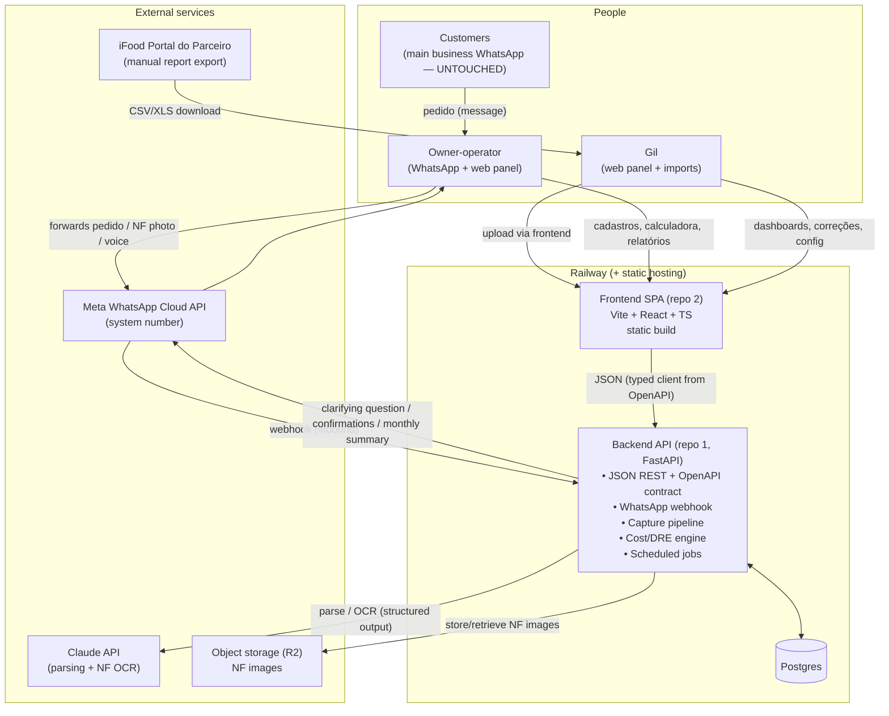

# Architecture Spec — Sistema de Gestão para Micro-Delivery de Salgados

**Version:** 0.2 (draft for Gil's review — v0.2 decouples backend/frontend per Gil's direction)
**Date:** 2026-07-04
**Author:** Claude (tech lead) with decisions by Gil
**Companion docs:** `prd.md` (v1.0, approved) · `discovery.md`
**Scope note:** specification only — no code lives in this repo yet.

---

## 1. Decisions already made (by Gil)

| # | Decision | Rationale |
|---|---|---|
| D1 | Deploy on **Railway** | Easy deploys, Gil's preference |
| D2 | **Official Meta WhatsApp Business Cloud API** for the system number | Zero ban risk; system number is new so the "no phone app" limitation is irrelevant; inbound-heavy usage is ~free |
| D3 | Budget ceiling **R$ 100/month**, target **≤ R$ 20–60** | Gil sponsors it for now |
| D4 | **Web interface for everyone** (owners + Gil), single shared panel for now; per-user roles/panels *maybe later* | Owners will cadastrar coisas and use the calculadora de receita themselves |
| D5 | Backend **Python or JS** — Gil delegated the pick | See D6 below |
| D5b | **Backend and frontend are decoupled projects** (separate repos, separate deploys, API contract between them) | Gil: the data layer (how we manage/store data) is the stable core; what we do with it (front) evolves in parallel; decoupled projects are easier to work on with multiple agents |

## 2. Decisions proposed by tech lead (approve/veto)

| # | Proposal | Rationale |
|---|---|---|
| D6 | ~~Python monolith with server-rendered UI~~ **VETOED by Gil (2026-07-04)** → replaced by D6b/D6c | Gil wants back/front decoupled (see D5b) |
| D6b | **Backend: Python API service — FastAPI + SQLAlchemy + Postgres.** JSON REST API, **OpenAPI schema as the published contract**. Owns ALL domain logic: capture pipeline, imports, cost engine, DRE computation, scheduled jobs. The frontend is a pure consumer — no business rules in the front | FastAPI generates the OpenAPI contract for free; typed client for the front can be generated from it. "Smart backend, dumb frontend" keeps the stable core (data + rules) in one place while the front iterates |
| D6c | **Frontend: separate JS SPA repo — Vite + React + TypeScript**, typed API client generated from the backend's OpenAPI schema; charts via a lightweight lib | No SSR/SEO needs (private tool) → SPA over Next.js: static build, trivially cheap hosting, smallest moving-parts count for a decoupled setup. Veto if you prefer Next.js |
| D7 | **Postgres (Railway managed)** as the single database | Boring, relational shape fits the domain, Railway-native |
| D8 | **In-process background jobs** (APScheduler or arq with Railway's Redis only if needed later) instead of a separate worker service | At 10 pedidos/day there is no queue pressure; fewer services = lower cost + less ops |
| D9 | **NF images in S3-compatible object storage (Cloudflare R2, free tier)**; DB stores only references | Railway volumes couple storage to the service lifecycle; R2 is free to 10 GB and survives redeploys |
| D10 | **Claude API** for message parsing and NF OCR (vision). Haiku-tier for parsing, Sonnet-tier for OCR; structured outputs (JSON schema) everywhere | At this volume: centavos/month. Model tiers are config, not code |
| D11 | **Auth v0: single shared login** (email+password, session cookie), but with a `users` table + `role` column from day one | Matches "same panel for everyone now"; enables the future two-panel split without migration pain |
| D12 | **PT-BR as the product language** (UI, robô replies, reports); code/schema in English | Users are Brazilian; maintainers read English code |

## 3. System overview

Two WhatsApp numbers, strictly separated:
- **Business number** (owners' phone, WhatsApp Business app): untouched. Customers keep ordering there; humans keep answering there. Outbound campaign messages (M7) are sent by humans from here.
- **System number** (Cloud API): capture-only front door + system notifications to the owner/Gil. Never talks to customers.

## 4. Components

### 4.1 Backend API service (repo 1 — the stable core)

Owns the data and every business rule. Exposes a versioned JSON REST API described by an **OpenAPI schema — the contract between the two projects** (and between agents working on them).

| Concern | Responsibility |
|---|---|
| **Domain API** | CRUD + queries for all entities (pedidos + review queue, produtos, preços, ingredientes, receitas/massas, compras, clientes, despesas, canais, formas de pagamento — all generic); computed resources: calculadora de receita (ficha técnica costing), DRE per period, dashboards aggregates, reconciliation, segments/alerts |
| **WhatsApp webhook** | Receives inbound events from Cloud API (text, image, audio, contact cards). Persists a raw `CaptureEvent` immediately (before any processing — capture is sacred), acks fast |
| **Capture pipeline** | Async task per CaptureEvent: classify (pedido / NF / payment confirmation / other) → route to parser (LLM structured output) or OCR (LLM vision) → create draft records with confidence + `needs_review` flag → reply to owner (confirmation or at most one clarifying question) |
| **Import pipeline** | iFood report files (CSV/XLS) received via API upload: parse → dedupe (by iFood order id) → create orders with channel=ifood, commission cost lines. Format-versioned parsers (risk: portal export changes) |
| **Scheduled jobs (in-process)** | Monthly DRE summary message to owner via system number; recurrence/segment recompute; margin-drift alerts; ingredient price staleness alerts; weekly DB backup dump to R2 |
| **Auth** | Token-based (JWT bearer, issued by a login endpoint); `users` table with `role` (admin/owner) from day one, single shared account in v0. CORS restricted to the frontend origin |

### 4.1b Frontend SPA (repo 2 — the evolving surface)

Vite + React + TypeScript, static build. **Zero business logic** — it renders what the API says and posts back user intent. API client **generated from the backend's OpenAPI schema** (contract drift becomes a compile error, not a runtime bug).

Pages (PT-BR): pedidos ledger + fila de revisão, cadastros (generic CRUD), **calculadora de receita**, compras, clientes, DRE & dashboards (chart lib over API aggregates), importação iFood (file upload), despesas, config, login.

Deliberately thin so it can be reshaped/rewritten as Gil's ideas for "what we do with the data" evolve — without touching the core.

### 4.2 Data stores

- **Postgres**: everything relational (entities in PRD §7). Single schema. Migrations via Alembic.
- **R2**: NF images and weekly `pg_dump` backups. Keyed by capture event id.

### 4.3 External integrations

| Integration | Mode | Notes |
|---|---|---|
| WhatsApp Cloud API | Webhook (inbound) + Graph API (outbound) | System number registered to a Meta Business; template messages only needed for system-initiated messages outside the 24h window (monthly summary, alerts) — a handful of pre-approved templates |
| Claude API | HTTPS, structured outputs | All prompts versioned in-repo; every LLM call logged with input/output for debugging and re-parsing after prompt fixes |
| iFood | **No integration.** Manual desktop export → web upload | Deliberate: file-based import is the only stable contract available |

## 5. Key data flows

### F1 — Pedido via WhatsApp (the core loop)
1. Customer messages the **business** number; owner replies as always.
2. Owner **forwards** the customer message(s) to the **system** number.
3. Webhook stores raw CaptureEvent → pipeline classifies as pedido → LLM extracts `{customer_hint, items[], quantities, values, delivery_date}` with confidence.
4. **Identity caveat (Cloud API limitation):** a forwarded message does *not* carry the original sender's phone. Resolution ladder: (a) content mentions the customer → match against known customers; (b) owner forwards the customer's **contact card** right after (one extra tap, encouraged habit); (c) robô asks **one** question: *"De quem é esse pedido?"*; (d) unresolved → pedido recorded with `customer=unknown`, flagged for review. Never block capture on identity.
5. Draft order created; robô replies with a one-line confirmation (*"Anotado: 50 coxinhas + 25 quibes, dona Maria, sexta — R$ 87"*). Corrections happen by replying in natural language or later in the web review queue.
6. Payment: owner sends *"pago pix dona maria"* (or taps the web) → payment record linked.

### F2 — Compra via NF photo
1. Owner/Gil sends NF/cupom photo to system number.
2. Image → R2; CaptureEvent → OCR (LLM vision) → `{supplier, date, items[{desc, qty, unit, unit_price}]}`.
3. Line items matched to the ingredient catalog (fuzzy + LLM-assisted; unmatched items create `needs_review` suggestions, never silent new ingredients).
4. Purchase recorded → **ingredient price history updated** → unit-cost snapshots recomputed → margin-drift alert if any product margin crosses its configured threshold.

### F3 — iFood weekly import
1. Owner/Gil downloads the vendas/conciliação report from Portal do Parceiro (desktop — existing weekly ritual, redirected).
2. Upload on the web UI → parser validates format version → orders upserted (dedupe by iFood id), commission/fees recorded as channel costs.
3. Reconciliation screen: caderninho total vs. system total vs. iFood repasse.

### F4 — Monthly close
1. Job aggregates the month: DRE (receita por canal − comissões − CMV − variáveis − fixas = resultado líquido).
2. Owner receives a short PT-BR summary via the system number (pre-approved template); full DRE on the web.

## 6. Non-functional requirements

| Concern | Stance |
|---|---|
| **Scale** | ~10 pedidos/day, 2–3 users. Design ceiling 100×; no premature optimization beyond that |
| **Availability** | Best-effort. If the app is down, WhatsApp retries webhooks (and messages sit in the owner's chat anyway — nothing is lost, capture is replayable from Meta's retry + re-forward) |
| **Durability** | The DB is the business's memory: Railway Postgres backups **plus** weekly `pg_dump` to R2. This is the one thing that must not be lost |
| **Auditability** | Every record traces back to its CaptureEvent (raw message/image + LLM parse + who corrected what). Re-parseable after prompt improvements |
| **Security** | HTTPS only; webhook signature verification (Meta `X-Hub-Signature-256`); secrets in Railway env vars; no card/bank data stored |
| **LGPD** | Personal data = customer name + phone, legitimate interest (order fulfillment/relationship). Data minimization; no data sold/shared; deletion path per customer (anonymize orders, keep aggregates) |
| **Observability** | Railway logs + a simple `/health`; error alerts to Gil via the system number (eat own dog food). No paid APM |
| **Maintainability** | Two small repos with a machine-checked contract (OpenAPI → generated client), boring libraries, prompts and parsers versioned in the backend repo. Target: any 20-minute window is enough to fix something. Degrades gracefully: if LLM parsing breaks, capture events still persist and manual entry still works; if the front breaks, the API and robô keep capturing |
| **API contract discipline** | The OpenAPI schema is the source of truth. Additive changes are free; breaking changes require a version bump (`/api/v1/…`) and a matching front release. Backend never assumes a specific front; front never bypasses the API |

## 7. Cost estimate (monthly)

| Item | Estimate |
|---|---|
| Railway Hobby plan (API service + Postgres usage) | ~US$ 5–10 (≈ R$ 28–55) |
| Frontend static hosting | ≈ R$ 0 (static SPA: Railway static site or Cloudflare Pages free tier) |
| WhatsApp Cloud API | ≈ R$ 0 at this volume (inbound free; ~30 template messages/month within/near free allowance) |
| Claude API (~300 parses + ~30 OCR/month) | < R$ 5 |
| Cloudflare R2 | R$ 0 (free tier, 10 GB) |
| **Total** | **≈ R$ 30–60/month** — inside the R$ 100 ceiling; the R$ 20 dream depends on Railway usage staying minimal |

## 8. Environments & delivery

- **Two repos**: `backend` (API + pipelines + jobs) and `frontend` (SPA). Independent lifecycles; the OpenAPI schema published by the backend is the only coupling point. This layout is deliberately multi-agent-friendly: one agent can work each repo in parallel against the frozen contract.
- **prod** on Railway: backend service + Postgres; frontend as a static deploy (Railway static or Cloudflare Pages). Single environment to start; local dev via Docker Compose Postgres — no staging until it hurts.
- Deploy: push-to-main → auto-deploy per repo. Backend migrations run on release. Contract check in the frontend CI: regenerate client from the deployed schema and type-check.
- Config (channels, thresholds, model tiers, prompt versions) via env vars + DB-backed settings — never code constants (PRD principle #2).

## 9. Risks (architecture-specific)

| # | Risk | Mitigation |
|---|---|---|
| A1 | Meta Business verification friction for the Cloud API number | Start the registration early (it can take days); Twilio WhatsApp as a paid fallback with the same webhook shape |
| A2 | Forwarded-message identity gap (F1 step 4) annoys the owner | Habit design: contact-card-after-forward taught once; measure % of pedidos with unresolved customer; if > 30%, revisit UX |
| A3 | iFood export format drift | Format-versioned parsers; import failures degrade to manual entry of ~10 orders/week |
| A4 | Contract drift between decoupled repos | OpenAPI as source of truth; generated typed client; breaking changes gated behind `/api/v1` versioning; frontend CI type-checks against the live schema |
| A5 | In-process scheduler lost on redeploy mid-job | Jobs are idempotent + re-run safe; schedule state in DB |

## 10. Next specs to write (in order)

1. **`specs/data-model.md`** — full entity/relationship spec (attributes, constraints, history/versioning rules). *Promoted to first: with back/front decoupled, the data model + API contract are the foundation everything else builds on — and the part Gil called "the most important".*
2. **`specs/api-contract-v0.md`** — the v0 API surface (resources, endpoints, auth, error shape, pagination/filter conventions) from which the OpenAPI schema will be authored.
3. **`specs/v0-capture-ledger.md`** — functional spec for the v0 MVP cut (M1 capture + M2 ledger + M4 raw purchases): robô conversation contracts, parsing schemas, review queue, acceptance criteria — backend-side.
4. **`specs/v0-frontend.md`** — v0 SPA pages against the frozen contract (can be built in parallel by another agent).
5. **`specs/v1-costs-dre.md`** — ficha técnica engine + DRE computation rules (calculadora de receita included).
6. **`specs/v2-crm-actions.md`** — segments, alerts, action lists, drafted messages.
