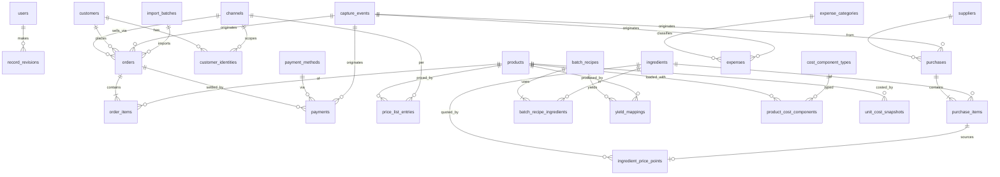

# Spec — Data Model

**Version:** 1.0 (approved by Gil 2026-07-04 with all §5 defaults accepted)
**Date:** 2026-07-04
**Companion docs:** `../prd.md` (v1.0) · `../architecture.md` (v0.2)
**Scope:** the backend's relational model — entities, attributes, relationships, constraints, versioning and provenance rules. Language-agnostic (tables described conceptually; exact DDL is an implementation detail). **No instances in the spec** — every catalog is data.

---

## 1. Design rules (apply to everything)

| # | Rule |
|---|---|
| R1 | **IDs:** UUIDs, generated by the backend. |
| R2 | **Money:** integer **centavos** everywhere. No floats for money, ever. |
| R3 | **Quantities:** exact decimals (`numeric`), with an explicit unit column where relevant. |
| R4 | **Time:** timestamps stored UTC; *business* dates (delivery date, competence month) are local dates in `America/Sao_Paulo`. |
| R5 | **Nothing financial is hard-deleted.** Orders/payments/purchases/expenses are voided (`voided_at` + reason), not removed. Catalogs use `archived_at` (soft archive). |
| R6 | **Provenance:** every record born from capture carries `capture_event_id`. Every record answers "where did this number come from?". |
| R7 | **Time-versioning patterns** (three, used deliberately): **(a) append-only points** for observed facts (ingredient prices); **(b) validity ranges** (`valid_from`/`valid_to`) for configured values (price lists, yields, cost components); **(c) snapshots** for computed values (unit costs) so historical reports never silently change. |
| R8 | **Parse-tolerance:** records created by AI may reference nothing — every FK from a captured record is nullable, paired with a `raw_*` text column and `needs_review` flag. A wrong-but-recorded pedido beats a lost one. |
| R9 | **Generic catalogs:** channels, payment methods, sale packs, expense categories, cost component types are **rows**, seeded via migration/admin UI, never enums in code. |
| R10 | **LGPD:** customer erasure = anonymization (null out `name`, `phone`, identities; keep orders for aggregates). One-way, logged. |

## 2. Entity map

## 3. Entities

### 3.1 Identity & config

**`users`** — panel logins. `id, name, email (unique), password_hash, role (admin | owner), archived_at, created_at`. v0 ships with one shared account; the column structure already supports the future two-panel split (D11).

**`settings`** — DB-backed key/value config (JSON values): review thresholds, margin-alert %, prompt versions, iFood commission default, DRE line ordering. Nothing behavioral hardcoded.

**`channels`** — `id, name, slug (unique), delivery_mode_default (own | platform | pickup), commission_pct_default (nullable), archived_at`. Seeded with whatsapp/ifood rows; extensible (encomendas, balcão…).

**`payment_methods`** — `id, name, slug (unique), archived_at`. Pix, dinheiro, cartão… all rows.

### 3.2 Catalog & pricing

**`products`** — the costable/sellable salgado type (generic). `id, name, slug (unique), description, base_unit_label (e.g. "unidade"), archived_at, created_at`. Costing is always **per base unit**; selling may be per pack (below).

**`price_list_entries`** — versioned prices per product × channel × pack. `id, product_id, channel_id, pack_size (int, base units per pack — 1, 100…), pack_label (free text: "unidade", "cento"…), price_centavos, valid_from (date), valid_to (date, null = current)`.
Constraints: no overlapping validity for the same `(product, channel, pack_size)`; changing a price closes the old row and opens a new one (append, never update-in-place). → *"what did a cento cost on iFood in March?" is always answerable.*

### 3.3 Customers

**`customers`** — `id, name (nullable), phone (nullable, E.164, unique when present), notes, first_seen_at, anonymized_at (LGPD), created_at`.
Identity anchor is **phone** for the WhatsApp channel; both fields nullable because capture must never block (R8).

**`customer_identities`** — channel-scoped external identities. `id, customer_id (nullable), channel_id, external_id, display_name, created_at`; unique `(channel_id, external_id)`.
iFood customers live here (masked ids from reports) even when unlinked (`customer_id` null) — they still count for volume/mix analysis. Linking an identity to a real customer is a manual/heuristic enrichment, never assumed.

### 3.4 Sales

**`orders`** — one row per pedido, any channel. Key fields:

| Group | Fields |
|---|---|
| Identity | `id, channel_id, customer_id (nullable), external_ref (e.g. iFood order id; unique per channel when present)` |
| Lifecycle | `status (draft → confirmed → delivered → cancelled)`, `ordered_at (ts)`, `delivery_date (local date)`, `delivery_mode (own | platform | pickup)` |
| Money | `gross_centavos, discount_centavos, platform_fee_centavos (commission etc.), net_centavos` (computed: gross − discount − fees) |
| Provenance | `capture_event_id (nullable), import_batch_id (nullable), needs_review (bool), raw_text (original forwarded message, for audit/re-parse)` |
| Audit | `voided_at, void_reason, created_at, updated_at` |

Payment status is **derived** (Σ payments vs. net), not a column — real life pays late, partially, or never; the model must not fight that.

**`order_items`** — `id, order_id, product_id (nullable), raw_description (as parsed/imported), pack_size (nullable), quantity (numeric), unit_price_centavos (nullable), total_centavos, needs_review`.
`product_id` null + `raw_description` filled = the AI couldn't match; review queue resolves it. CMV computation skips unmatched items and reports coverage %.

**`payments`** — `id, order_id, payment_method_id (nullable), amount_centavos, paid_at, registered_by (user or capture), capture_event_id (nullable), voided_at, created_at`. Multiple payments per order allowed (partials, troco corrections).

### 3.5 Purchases & ingredient prices

**`suppliers`** — light: `id, name, cnpj (nullable), archived_at`. Auto-created from NF OCR (fuzzy-matched by CNPJ/name).

**`purchases`** — `id, supplier_id (nullable), purchased_at (date), total_centavos, source (nf_ocr | manual), nf_image_ref (R2 key, nullable), capture_event_id (nullable), needs_review, voided_at, created_at`.

**`purchase_items`** — `id, purchase_id, ingredient_id (nullable), raw_description, quantity (numeric), unit (as written), quantity_canonical (numeric, converted), unit_price_centavos, total_centavos, needs_review`.
Unit conversion (kg→g etc.) happens at ingestion; unresolved units flag review.

**`ingredients`** — `id, name, slug (unique), canonical_unit (g | ml | un), aliases (text[], feeds NF matching), archived_at`.

**`ingredient_price_points`** — append-only observed prices: `id, ingredient_id, price_per_canonical_unit (numeric centavos, high precision), effective_date, source_purchase_item_id (nullable — null = manual quote), created_at`.
"Current price" = latest point ≤ today. Never updated, only appended (R7a). Staleness alerts read from here.

### 3.6 Production costing (the calculadora de receita)

Mirrors the owners' batch mental model (PRD principle #5).

**`batch_recipes`** — a producible batch (massa, recheio…): `id, name, kind (slug into a seeded `recipe_kinds` catalog), output_quantity (numeric), output_unit, version (int), superseded_by_id (nullable), archived_at, created_at`.
Editing a recipe **creates a new version** and closes the old (append pattern) — historical cost snapshots keep pointing at the version that was true then.

**`batch_recipe_ingredients`** — `id, batch_recipe_id, ingredient_id, quantity (numeric), unit (canonical)`.

**`yield_mappings`** — how many product base-units one batch yields: `id, batch_recipe_id, product_id, units_yielded (numeric), valid_from, valid_to`. (1 massa → 120 coxinhas *or* 90 esfihas = two rows.)

**`cost_component_types`** — seeded catalog: embalagem, fritura/gás, óleo, perdas, mão-de-obra (optional)… `id, name, slug, mode (fixed_per_unit | pct_of_cost)`.

**`product_cost_components`** — per-product extra loads: `id, product_id, cost_component_type_id, value (centavos or pct), valid_from, valid_to`.

**`unit_cost_snapshots`** — computed, frozen results: `id, product_id, computed_at, effective_date, total_cost_per_unit (numeric centavos), breakdown (JSON: batch shares by recipe version, component values, ingredient prices used), trigger (price_change | recipe_change | component_change | manual | scheduled)`.
**The DRE and margin views only ever read snapshots** — recomputing today never rewrites March. Recompute triggers append a new snapshot.

Unit cost formula (spec-level): `Σ over recipes feeding the product ( batch_ingredient_cost(recipe version, prices as-of date) / units_yielded ) + fixed components + pct components`, where multiple massa/recheio recipes can feed one product.

### 3.7 Expenses & DRE inputs

**`expense_categories`** — `id, name, slug, kind (fixed | variable), dre_line (slug into the DRE layout config), archived_at`. Gás, luz, DAS-MEI, embalagens*, combustível… all rows. (*embalagem appears both as a unit cost component and, if preferred, as a period expense — configuration decides which side counts in the DRE to avoid double-counting; see Open Q4.)

**`expenses`** — `id, expense_category_id, description, amount_centavos, competence_month (local YYYY-MM), paid_at (nullable date), recurring_template_id (nullable), capture_event_id (nullable), voided_at, created_at`.
Both **competência** and **caixa** dates captured; the gerencial DRE runs on **competência** (delivery/consumption month), a caixa view is derivable later.

**`recurring_expense_templates`** — `id, expense_category_id, description, amount_centavos, day_of_month, active` — the scheduler materializes monthly rows (DAS, contas fixas) as drafts for confirmation.

**DRE itself is not a table** — it's a computed resource: receita (delivered orders by competence month, by channel) − deduções (platform_fee) − CMV (Σ matched order items × snapshot as-of delivery date) − variáveis − fixas = resultado. The DRE line layout lives in `settings` (R9). Coverage indicators (% items matched, % orders with customer) ship with every DRE so trust is measurable.

### 3.8 Capture & provenance backbone

**`capture_events`** — the audit trail behind everything (R6):

| Group | Fields |
|---|---|
| Origin | `id, source (whatsapp | upload | manual | api), wa_message_id (unique, dedupe), sender_phone, received_at` |
| Content | `kind (order | nf | payment_confirmation | contact_card | voice | other — classified)`, `raw_payload (JSON — full webhook body)`, `media_ref (R2 key, nullable)`, `transcript (voice→text, nullable)` |
| Processing | `parse_result (JSON, schema-versioned), confidence (0–1), prompt_version, status (received → classified → parsed → applied | needs_review | discarded)`, `error (nullable), processed_at` |

Immutable once written except `status`/links. Re-parse after prompt fixes = new parse_result appended in JSON history, never overwritten.

**`import_batches`** — iFood file uploads: `id, channel_id, file_ref (R2), format_version, uploaded_by, row_count, created_count, duplicate_count, error_rows (JSON), created_at`.

**`record_revisions`** — lightweight audit of human corrections: `id, entity_type, entity_id, user_id, diff (JSON), created_at`. Written by the API on any mutation of financial records.

## 4. Integrity & derivation summary

- Unique keys: `customers.phone`, `(channel, external_id)` on identities and on `orders.external_ref`, `capture_events.wa_message_id` (webhook retries dedupe here).
- Derived, never stored: order payment status, current ingredient price, current price list, customer segments (computed by jobs from orders — segment definitions in `settings`), the DRE.
- Stored precisely because they're derived-but-must-freeze: `unit_cost_snapshots`.
- Every money mutation path: void + insert, never edit amounts silently (revisions log the who/when).

## 5. Design calls — resolved 2026-07-04 (Gil accepted all defaults)

1. Mão-de-obra → **modeled but zero-valued**. 2. Perdas → **flat % per product**. 3. Delivery fee → **optional `delivery_fee_centavos` on orders**. 4. Embalagem → **unit cost component** (expense category only for bulk-purchase price tracking). 5. Caderninho backfill → **import consolidated daily orders flagged `source=backfill`** (if granularity allows).

Original questions kept below for context:

1. **Mão-de-obra dos donos** in unit cost: include as a cost component (honest economics) or keep out (family business reality)? Default: modeled but zero-valued — the column exists, they decide.
2. **Perdas**: flat % per product (simple) is what's specced. Good enough, or track actual waste events someday (v2+)?
3. **Delivery fee charged to customers** on the WhatsApp channel — does it exist? If yes it needs a field on `orders` (`delivery_fee_centavos`, revenue side). Specced as present-but-optional.
4. **Embalagem**: count inside unit cost (component) or as period expense? Recommendation: unit cost component, and the expense category exists only for bulk purchases feeding ingredient-style price tracking. Confirm.
5. Historical backfill of the caderninho: if it turns out to be per-day totals only, do we import as synthetic "daily consolidated" orders (keeps trend charts honest) or start clean? Recommendation: import consolidated, flagged `source=backfill`.
